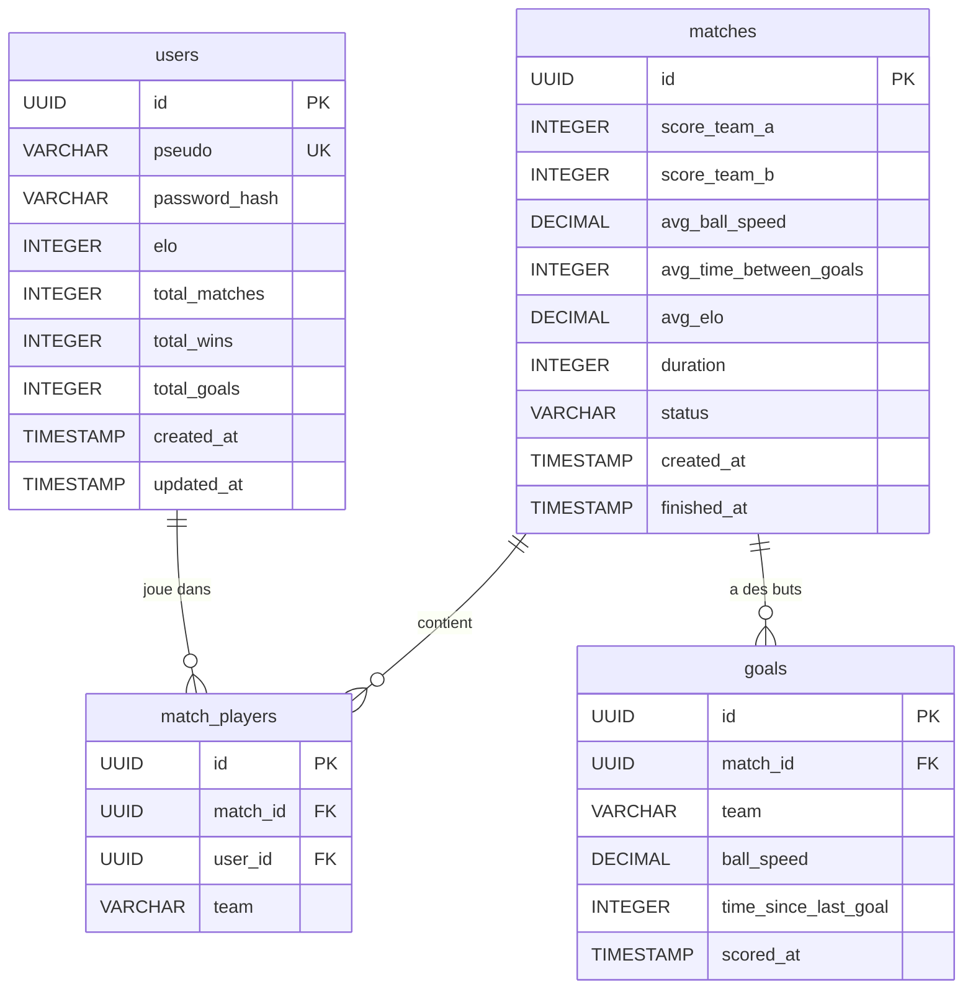

# BeeFootFlow.db - Schema Relationnel

## Relations

| Relation | Description |
|----------|-------------|
| `users` → `match_players` | Un joueur peut participer a plusieurs matchs |
| `matches` → `match_players` | Un match a 2 a 4 joueurs (1v1 ou 2v2) |
| `matches` → `goals` | Un match contient 0 a N buts |

## Metriques couvertes

| Metrique | Localisation |
|----------|-------------|
| Equipe A / Equipe B | `match_players.team` (A ou B) |
| Score | `matches.score_team_a` / `matches.score_team_b` |
| Nombre de buts | `COUNT` sur `goals` |
| Vitesse de balle | `goals.ball_speed` |
| Vitesse moyenne de balle | `matches.avg_ball_speed` |
| Temps entre buts (par but) | `goals.time_since_last_goal` |
| Temps moyen entre buts (par match) | `matches.avg_time_between_goals` |
| Elo moyen | `matches.avg_elo` |
| Temps de match | `matches.duration` |
